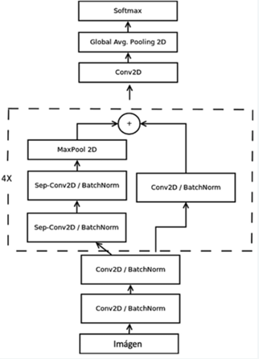
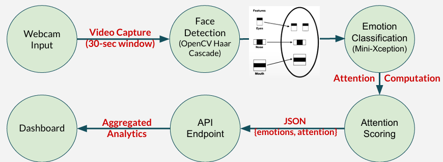

# classroom-emotion-system

**Real-Time Facial Emotion Recognition for Student Engagement in Classrooms**

---

## **Problem Statement**

In remote or hybrid learning environments, instructors often lack **real-time feedback** on students' emotional engagement. This gap reduces teaching effectiveness and limits opportunities to adapt based on students' responses.

Our system addresses this problem by using **computer vision and emotion classification** to detect student engagement levels through facial expressions. With minimal latency and no personal data storage, this tool enables **real-time attention tracking**, helping educators tailor instruction dynamically.

---

## **Model Architecture**

We used the **Mini-Xception CNN** model trained on the FER-2013 dataset. It balances high classification accuracy with low computational cost, making it ideal for real-time inference.

---

## **System Pipeline**

The real-time pipeline captures webcam input and processes facial emotions through a lightweight CV + DL stack. Attention scoring is computed and visualized in a teacher dashboard.

---

## **Key Features**

- Real-time emotion detection with latency < 2s
- Local face processing via OpenCV Haar Cascade
- Emotion classification using Mini-Xception
- Attention score estimation (time-weighted)
- API endpoint for session aggregation
- Privacy-preserving design (no face storage)
- Achieved >90% binary emotion classification accuracy

---

## **Tech Stack**

- **Python**, **OpenCV**, **Streamlit**
- **Mini-Xception** (Keras, TensorFlow)
- **RESTful API** for dashboard integration

---

## **Author**

  
**Zih-Han Shen**  
Master of Business Analytics @ ASU  
Email: shenzihhan@gmail.com  
LinkedIn Profile: [LinkedIn](https://www.linkedin.com/in/zih-han-shen-552983286/)
Project Slide Deck (Google Slides) (https://docs.google.com/presentation/d/1AQ_o65YSPdLY_ItdcK84hoQEtoyzCfxW/edit?usp=sharing&ouid=104301292306575929503&rtpof=true&sd=true)  

---
